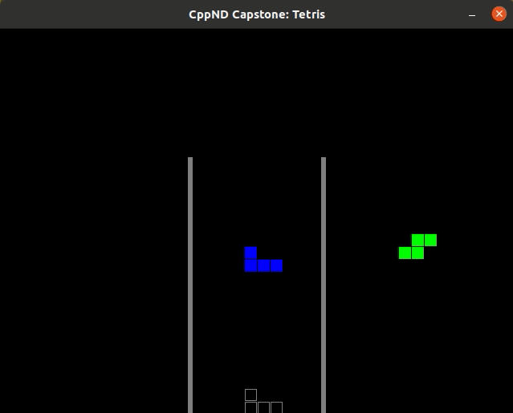

# CppND-Capstone: Tetris Game
This is the repository for [Udacity C++ Nanodegree Program](https://www.udacity.com/course/c-plus-plus-nanodegree--nd213) Capstone project. It is based off of the example [Capstone Project](https://github.com/udacity/CppND-Capstone-Snake-Game)



For this project, I have built my own C++ application that implements the Tetris game, following the principles I have learned throughout this Nanodegree program. 

This implementation follows rules set by the [Super Rotation System](https://tetris.fandom.com/wiki/SRS), excluding wall-kicks. Spawn orientation, location, color schemes, and rotations are based off the SRS guidelines.

This project uses the SDL library and a modified CMake file. The controler aspect is embedded into main.cpp but I have tried to stick to the game, renderer, controller model otherwise.

## Depenencies for Running Locally
* cmake >= 3.7
  * All OSes: [click here for installation instructions](https://cmake.org/install/)
* make >= 4.1 (Linux, Mac), 3.81 (Windows)
  * Linux: make is installed by default on most Linux distros
  * Mac: [install Xcode command line tools to get make](https://developer.apple.com/xcode/features/)
  * Windows: [Click here for installation instructions](http://gnuwin32.sourceforge.net/packages/make.htm)
* SDL2 >= 2.0
  * All installation instructions can be found [here](https://wiki.libsdl.org/Installation)
  >Note that for Linux, an `apt` or `apt-get` installation is preferred to building from source. 
* gcc/g++ >= 5.4
  * Linux: gcc / g++ is installed by default on most Linux distros
  * Mac: same deal as make - [install Xcode command line tools](https://developer.apple.com/xcode/features/)
  * Windows: recommend using [MinGW](http://www.mingw.org/)

## Basic Build and Run Instructions
```
git clone https://github.com/Edward-Zam/CppND-Capstone
mkdir build && cd build
cmake .. && make
./Tetris
```

## Controls
Left Arrow: Move Tetromino left

Right Arrow: Move Tetromino Right

Down Arrow: Move Tetromino down one space

Up Arrow: Rotate Tetromino

Space: Drop Tetromino

ESC: Quit the program
